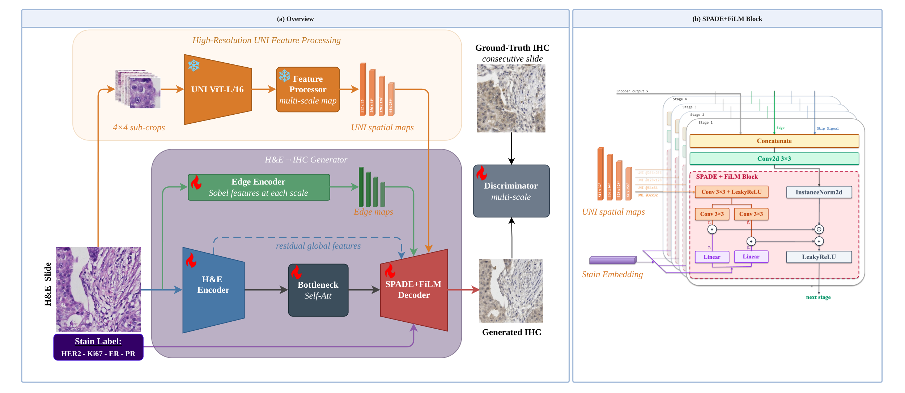
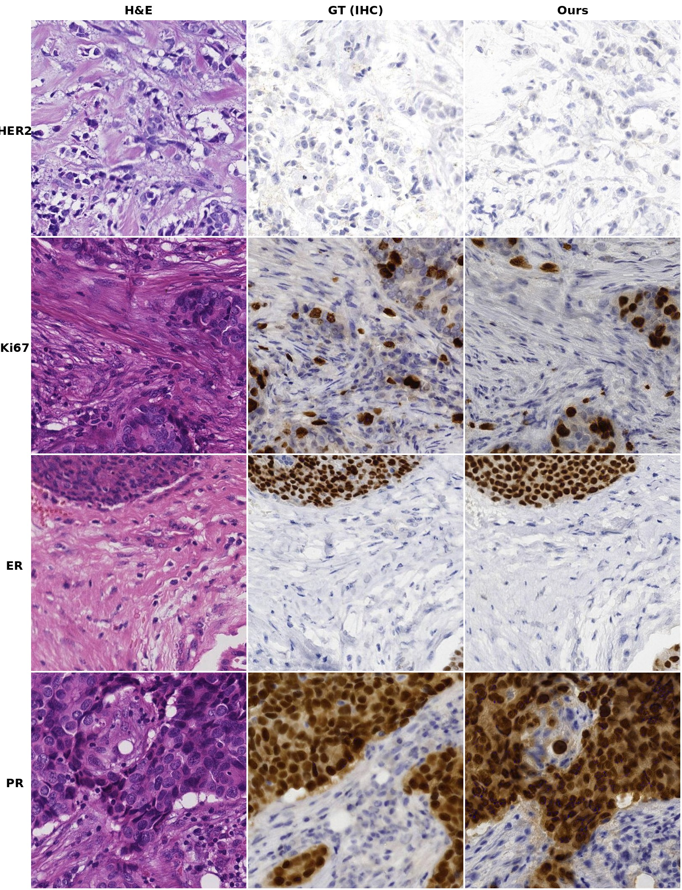
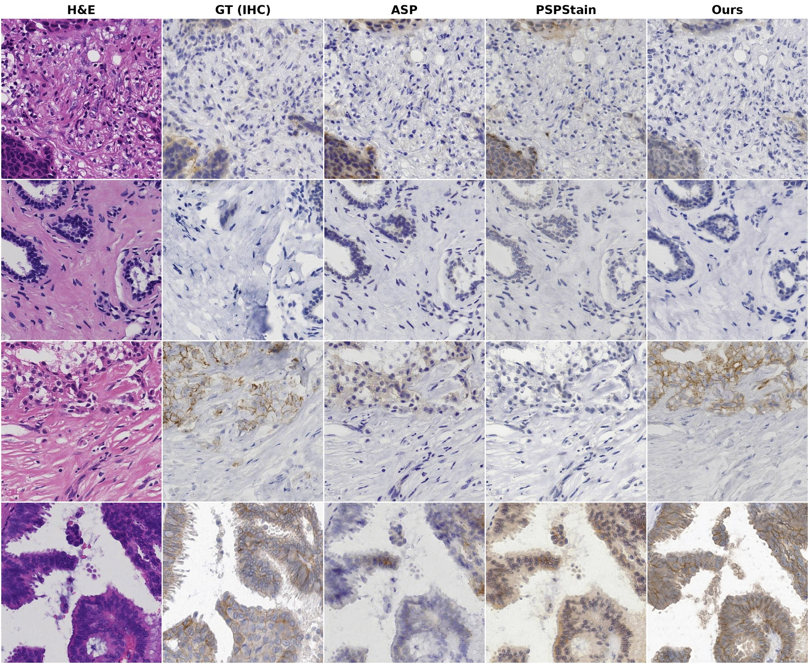
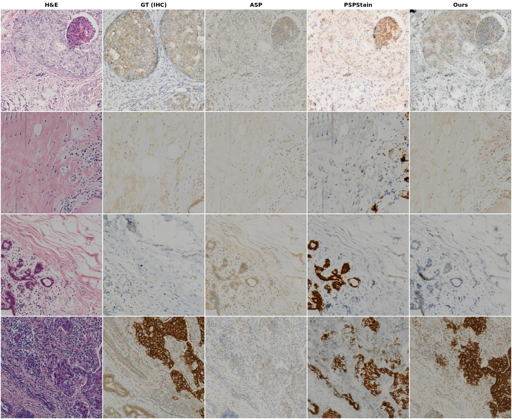

# UNIStainNet: Foundation-Model-Guided Virtual Staining of H&E to IHC

<p align="center">
  <a href="https://arxiv.org/abs/2603.12716"></a>
  <a href="https://huggingface.co/spaces/faceless-void/UNIStainNet"></a>
  <a href="https://facevoid.github.io/UNIStainNet/"></a>
</p>

<p align="center">
  
</p>

**UNIStainNet** is a SPADE-UNet generator conditioned on dense spatial tokens from a frozen [UNI](https://github.com/mahmoodlab/UNI) pathology foundation model (ViT-L/16). A single 42M-parameter model generates multiple IHC stains (HER2, Ki67, ER, PR) from H&E input via learned stain embeddings with FiLM modulation.

## Key Features

- **Dense UNI spatial conditioning**: 32×32 = 1,024 spatial tokens from a frozen UNI ViT-L/16, providing 64× more spatial tokens than CLS-token approaches
- **Misalignment-aware losses**: Designed for consecutive-section training pairs with 10–50 px misalignment (perceptual loss, unconditional discriminator, DAB intensity supervision)
- **Unified multi-stain model**: One model serves four IHC markers at 4× fewer parameters than per-stain specialists, with comparable stain accuracy
- **Tissue-type stratified failure analysis**: Zero-shot tissue classification reveals where generation fails (non-tumor tissue) vs. succeeds (invasive carcinoma: <3% failure rate on MIST)

## Results

### MIST (unified model, all four stains)

| Stain | FID ↓ | KID×1k ↓ | SSIM ↑ | P-r ↑ | DAB KL ↓ |
|-------|-------|-----------|--------|-------|----------|
| HER2  | **34.5** | **2.2** | **0.229** | 0.929 | 0.166 |
| Ki67  | **27.2** | **1.8** | **0.282** | 0.927 | 0.119 |
| ER    | **29.2** | **1.8** | **0.258** | 0.949 | 0.182 |
| PR    | **29.0** | **1.1** | **0.269** | 0.943 | 0.171 |

### BCI (HER2)

| FID ↓ | KID×1k ↓ | SSIM ↑ | P-r ↑ | DAB KL ↓ |
|-------|-----------|--------|-------|----------|
| **34.6** | **6.5** | **0.541** | **0.867** | **0.482** |

### Multi-Stain Generation (MIST)

A single model produces stain-specific expression patterns — membrane (HER2), punctate nuclear (Ki67), and diffuse nuclear (ER/PR):

<p align="center">
  
</p>

### Cross-Stain Generation

The same H&E input translated to four IHC stains by changing only the stain embedding. ER and PR produce visually similar diffuse nuclear staining, consistent with their co-expression in most breast cancers:

<p align="center">
  
</p>

### Qualitative Comparisons

<details>
<summary>MIST — HER2 comparison with prior methods (click to expand)</summary>

</details>

<details>
<summary>BCI — HER2 class-wise comparison (click to expand)</summary>

</details>

## Installation

```bash
pip install -r requirements.txt
pip install -e .
```

UNI model weights are downloaded automatically via `timm` from [MahmoodLab/uni](https://huggingface.co/MahmoodLab/uni). You will need a Hugging Face token with access granted.

## Data Preparation

### BCI Dataset

Download from the [BCI Challenge](https://bupt-ai-cz.github.io/BCI/) and organize as:

```
BCI_dataset/
├── HE/
│   ├── train/       # H&E training images (1024×1024)
│   ├── test/        # H&E test images
│   └── val/         # (optional)
└── IHC/
    ├── train/       # IHC (HER2) training images
    ├── test/
    └── val/         # (optional)
```

Images are paired by filename. HER2 class labels (0, 1+, 2+, 3+) are inferred from filename prefixes.

### MIST Dataset

Download from [MIST](https://doi.org/10.5281/zenodo.4751737) and organize as:

```
MIST/
├── HER2/
│   └── TrainValAB/
│       ├── trainA/   # H&E images (512×512)
│       ├── trainB/   # IHC HER2 images
│       ├── testA/
│       └── testB/
├── Ki67/
│   └── TrainValAB/ ...
├── ER/
│   └── TrainValAB/ ...
└── PR/
    └── TrainValAB/ ...
```

## Training

### BCI (HER2, class-conditioned)

```bash
python scripts/train/train_bci.py \
    --data_dir /path/to/BCI_dataset \
    --batch_size 4 \
    --max_epochs 100
```

### MIST (multi-stain, unified model)

```bash
python scripts/train/train_mist.py \
    --data_dir /path/to/MIST \
    --batch_size 16 \
    --max_epochs 75
```

Train on a subset of stains:

```bash
python scripts/train/train_mist.py \
    --data_dir /path/to/MIST \
    --stains HER2 Ki67
```

## Evaluation

### BCI

```bash
python scripts/eval/eval_bci.py \
    --checkpoint checkpoints/bci/last.ckpt \
    --data_dir /path/to/BCI_dataset
```

### MIST

```bash
python scripts/eval/eval_mist.py \
    --checkpoint checkpoints/mist_multistain/last.ckpt \
    --data_dir /path/to/MIST
```

Evaluate specific stains:

```bash
python scripts/eval/eval_mist.py \
    --checkpoint checkpoints/mist_multistain/last.ckpt \
    --data_dir /path/to/MIST \
    --stains HER2 Ki67
```

## Architecture

| Component | Details |
|-----------|---------|
| Generator | SPADE-UNet with UNI spatial conditioning + FiLM stain embeddings |
| Discriminator | Multi-scale PatchGAN (512 + 256) with spectral norm |
| Edge Encoder | Multi-scale RGB-aware Sobel edge extraction |
| UNI Features | 4×4 sub-crop tiling → UNI ViT-L/16 → 32×32 spatial tokens (1024-dim) |
| Parameters | 42M (generator) + 11M (discriminator), UNI frozen (303M) |

## Metrics Reference

| Metric | Description |
|--------|-------------|
| FID / KID | Distributional distance (Inception features) |
| FID-UNI | FID in UNI feature space |
| LPIPS | Learned perceptual similarity |
| SSIM / PSNR | Pixel-level similarity (less reliable under misalignment) |
| DAB P-r | Pearson-r of per-image DAB p90 intensity scores |
| DAB KL / JSD | Distributional divergence of DAB histograms |
| IOD / mIOD | Integrated optical density |

**DAB p90 score**: Mean intensity of pixels at or above the 90th percentile of the DAB channel (mean of top-10%), computed via Beer–Lambert color deconvolution.

## Project Structure

```
├── src/
│   ├── models/
│   │   ├── generator.py         # SPADE-UNet generator
│   │   ├── blocks.py            # SPADE+FiLM, ResBlk, attention blocks
│   │   ├── discriminator.py     # Multi-scale PatchGAN
│   │   ├── trainer.py           # PyTorch Lightning training module
│   │   ├── uni_processor.py     # UNI feature extraction + processing
│   │   ├── edge_encoder.py      # Sobel edge encoder
│   │   └── losses.py            # Perceptual, adversarial, DAB losses
│   ├── data/
│   │   ├── bci_dataset.py       # BCI dataset loader
│   │   └── mist_dataset.py      # MIST multi-stain dataset loader
│   └── utils/
│       ├── dab.py               # DAB color deconvolution
│       └── metrics.py           # Evaluation metrics (FID, KID, LPIPS, DAB, IOD)
├── scripts/
│   ├── train/                   # Training scripts
│   └── eval/                    # Evaluation scripts
└── requirements.txt
```

## License

This project is for research purposes only. UNI model weights are subject to their own [license terms](https://huggingface.co/MahmoodLab/uni).
